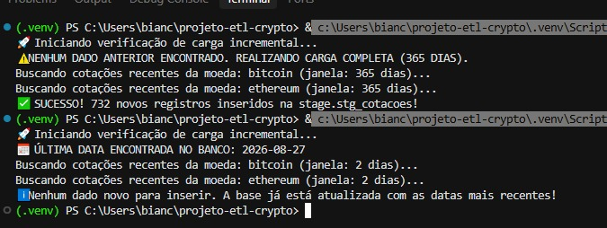

# 🪙 Pipeline de ETL & Analytics de Criptomoedas

Pipeline completo de Engenharia e Business Analytics (Extract, Transform, Load) que extrai dados históricos de criptoativos via API, realiza o tratamento e modelagem dimensional em um banco de dados relacional e entrega insights estratégicos em um painel interativo no Power BI.

---

## 📸 1. Visualização do Dashboard Executivo

> 💡 **Dica de Visualização:** Como os arquivos `.pbix` não são renderizados diretamente no navegador, veja abaixo a captura de tela do ambiente analítico finalizado. O arquivo original está disponível na raiz deste repositório para download local.


---

## 🎯 2. Escopo do Projeto & Solução de Negócio
O objetivo principal deste projeto é monitorar e prospectar o comportamento dos dois principais criptoativos do mercado global: **Bitcoin (BTC)** e **Ethereum (ETH)**. 

A solução resolve o problema de consolidação de dados fragmentados, centralizando históricos e projeções em uma única base de dados estruturada para análise macroeconômica e tomada de decisão corporativa utilizando a moeda padrão internacional (**Dólar Americano - USD**).

## 🛠️ 3. Tecnologias Utilizadas
* **Linguagem Principal:** Python 3 (Scripts de automação)
* **Manipulação de Dados:** Pandas
* **Carga e ORM:** SQLAlchemy
* **Fonte de Dados:** CoinGecko API (Dados públicos de mercado)
* **Banco de Dados (Data Warehouse):** PostgreSQL hospedado em nuvem (NeonDB)
* **Business Intelligence:** Power BI Desktop (Modelagem e UX/UI)

## 🗃️ 4. Modelagem do Banco & Camada Semântica (Views SQL)
Para alimentar o dashboard de forma otimizada e performática, o modelo de BI consome dados refinados diretamente de 5 Views SQL estratégicas criadas no banco de dados:

1. `public.vw_12_meses_com_projecao`: Consolida o histórico temporal das cotações de fechamento diário do último ano.
2. `public.vw_analitica_dia_semana`: Calcula o preço médio e volume médio negociado por cada dia da semana para identificar padrões de volatilidade.
3. `public.vw_projecoes_5_dias`: Armazena os cálculos matemáticos de tendência futura para o curto prazo.
4. `public.vw_fato_cotacoes_analitica`: Tabela fato principal do modelo com métricas de volume spot e capitalização de mercado (Market Cap).
5. `public.vw_analitica_resumo_mensal`: Agrupa os fechamentos consolidados por mês e ano (Média, Máxima e Mínima histórica).


## Estrutura do projeto
```
projeto-etl-crypto/
├── sql/            # scripts de criação de tabelas e views
├── src/            # código fonte do ETL
├── tests/          # testes automatizados
├── docs/           # documentação adicional
├── config/         # configurações do projeto
├── requirements.txt
└── .env.exemplo    # modelo de variáveis de ambiente
```

## Como rodar o projeto

1. Clone o repositório
```bash
git clone https://github.com/girls-dev-br/projeto-etl-crypto.git
cd projeto-etl-crypto
```

2. Crie e ative o ambiente virtual
```bash
python -m venv .venv
source .venv/Scripts/activate    # Windows (Git Bash)
```

3. Instale as dependências
```bash
pip install -r requirements.txt
```

4. Configure as variáveis de ambiente
```bash
cp .env.exemplo .env
# preencha o .env com suas próprias credenciais
```

5. Execute o projeto
```bash
python src/main.py
```

## 📸 Demonstração

O pipeline foi validado em ambiente de desenvolvimento, cobrindo desde a coleta bruta até a estruturação analítica final.

### 1. Extração e Carga Incremental (Staging)
* **Processamento Bruto:** Coleta automatizada de dados históricos diretamente da API CoinGecko para a tabela `stg_cotacoes`.


* **Automação de Carga:** Script executado via agendador de tarefas garantindo a carga incremental dos últimos 12 meses mais projeções.


### 2. Camada Semântica & Modelagem Relacional
Para alimentar o ambiente do Power BI, o banco consome os dados transformados por meio das 5 views estruturadas:
* `public.vw_12_meses_com_projecao`
* `public.vw_analitica_dia_semana`
* `public.vw_projecoes_5_dias`
* `public.vw_fato_cotacoes_analitica`
* `public.vw_analitica_resumo_mensal`

---

## 👩‍💻 Autoras

Unimos nossas habilidades para construir esta solução de ponta a ponta. Conecte-se conosco:

| Autora | LinkedIn | GitHub |
| :--- | :---: | :---: |
| **Paula Carvalho** | [](https://www.linkedin.com/in/paula-carvalho-390147108/) | [](https://github.com/paulahcarvalho) |
| **Bianca Pena** | [](https://linkedin.com) | [](https://github.com/BiaPena-br) |
| **Sara Trindade** | [](https://www.linkedin.com/in/sara0333/) | [](https://github.com/saradataeng) |
| **Paula Cristine** | `-` | [](https://github.com/paulinhacelebrai) |
