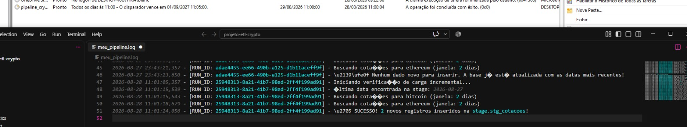

# ETL de Criptomoedas

Pipeline de ETL (Extract, Transform, Load) que extrai dados de criptomoedas 
da API CoinGecko, transforma os dados e carrega em um mini Data Warehouse no PostgreSQL.

## Tecnologias utilizadas

- Python
- Pandas
- SQLAlchemy
- API CoinGecko
- PostgreSQL

## Funcionalidades

- Extração de dados de mercado de criptomoedas via API
- Transformação e tratamento dos dados
- Carga em banco de dados relacional
- Testes automatizados

## Estrutura do projeto
```
projeto-etl-crypto/
├── sql/            # scripts de criação de tabelas e views
├── src/            # código fonte do ETL
├── tests/          # testes automatizados
├── docs/           # documentação adicional
├── config/         # configurações do projeto
├── requirements.txt
└── .env.exemplo    # modelo de variáveis de ambiente
```

## Como rodar o projeto

1. Clone o repositório
```bash
git clone https://github.com/girls-dev-br/projeto-etl-crypto.git
cd projeto-etl-crypto
```

2. Crie e ative o ambiente virtual
```bash
python -m venv .venv
source .venv/Scripts/activate    # Windows (Git Bash)
```

3. Instale as dependências
```bash
pip install -r requirements.txt
```

4. Configure as variáveis de ambiente
```bash
cp .env.exemplo .env
# preencha o .env com suas próprias credenciais
```

5. Execute o projeto
```bash
python src/main.py
```

## 📸 Demonstração

### 1. Extração dos dados (staging)

Coleta dos dados brutos da API CoinGecko e carga incremental dos últimos 12 meses até 5 dias posteriores ao ínicio na tabela `stg_cotacoes` .


Coleta dos dados brutos da API CoinGecko e carga automatizada com agendador na tabela `stg_cotacoes`.


## Autoras

Projeto desenvolvido por Bianca Pena, Paula Carvalho, Paula Cristine e Sara Trindade.
